# Agentic RAG Eval

[简体中文](README.zh-CN.md)

This project is the implementation starter for the internship project:

> Agentic RAG evaluation and optimization harness for LLM platform backends.

It is designed around the planned RAGFlow + CrewAI story:

- RAGFlow or a local RAG service provides answers and retrieved evidence.
- LangGraph orchestrates the evaluation harness over a query set.
- LangChain `RunnableLambda` nodes wrap each workflow step.
- The harness outputs JSONL, CSV, and Markdown reports for interview-ready analysis.
- The first implementation has a mock RAG client, so the smoke test works without API keys or Docker.

## Project Flowchart

```mermaid
flowchart TD
	A([User medical question]) --> B[InputGuard<br/>prompt injection / unsafe request / privacy filter]
	B --> B1{Input safe?}
	B1 -- malicious --> B2[Safe refusal or emergency-safe handling<br/>keep only medical facts]
	B1 -- safe or sanitized --> C[IntakeAgent<br/>extract complaint, symptoms, duration, history, medication]
	B2 --> C

	subgraph S1[Guided intake and triage]
		C --> D{Enough clinical slots?}
		D -- no --> E[GuidedIntakeAgent<br/>ask targeted questions]
		E --> E1[Pain template<br/>location / severity / first onset / interval / triggers / medication effect / red flags]
		E1 --> F[User clarification]
		F --> C
		D -- yes --> G[SafetyTriageAgent<br/>red flags and risk level]
		G --> G1{Risk level}
		G1 -- emergency --> H[EmergencyResponseAgent<br/>urgent care guidance, no ordinary advice]
		G1 -- high/medium/low --> I[MemoryRetrieveAgent<br/>load relevant session / profile / episodic memory]
	end

	subgraph S2[Memory governance]
		I --> I1[Session Memory<br/>current symptoms, asked questions, selected experts]
		I --> I2[Profile Memory<br/>confirmed age/sex/allergy/chronic disease/long-term meds]
		I --> I3[Episodic Memory<br/>past consultation and follow-up summaries]
		I1 --> J[DepartmentRouterAgent<br/>select departments and expert agents]
		I2 --> J
		I3 --> J
	end

	subgraph S3[Dynamic routing and MCP tools]
		J --> J1{Selected experts}
		J1 --> J2[GeneralPracticeAgent]
		J1 --> J3[Department Experts<br/>respiratory / cardiology / GI / pediatrics / OB-GYN / dermatology / neurology]
		J1 --> J4[PharmacistAgent<br/>drug safety and interactions]
		J1 --> J5[ReportInterpreterAgent<br/>lab and imaging report explanation]
		J --> K[SearchRouterAgent<br/>choose medical guide / drug / local RAG / web search]
		K --> L[ToolCallPolicyGuard<br/>tool allowlist / parameter validation / timeout budget]
		L --> L1{Tool health}
		L1 -- healthy --> L2[MCP tool calls]
		L1 -- degraded/down --> L3[Fallback<br/>retry once / local RAG / safe clarifying question]
	end

	subgraph S4[Medical knowledge retrieval]
		L2 --> M[MedicalHybridRetriever]
		L3 --> M
		M --> M1[LTP medical tokenizer + dictionary<br/>term normalization and synonyms]
		M1 --> M2[BM25 keyword filtering<br/>drug names, diseases, tests, red flags]
		M2 --> M3[Medical vector reranking<br/>medical embedding / Milvus or FAISS]
		M3 --> M4[Neo4j knowledge graph expansion<br/>disease-drug-symptom-test graph]
		M4 --> M5[TransH relation-enhanced ranking<br/>relation hyperplanes for treats / adverse effects / contraindications]
	end

	subgraph S5[Evidence cleaning and fusion]
		M5 --> N[RetrievedContentGuard<br/>block retrieved prompt injection]
		N --> O[WebEvidenceCleaner<br/>dirty data cleaning, dedup, freshness, unsafe-claim filter]
		O --> P[EvidenceFusionAgent<br/>source trust + evidence level + freshness weighting]
		P --> Q[ConflictResolverAgent<br/>new guideline > drug label > high evidence > conservative warning]
		Q --> Q1{Conflict unresolved?}
		Q1 -- yes --> Q2[Mark conflict<br/>recommend doctor/pharmacist confirmation]
		Q1 -- no --> R[Clean evidence package]
		Q2 --> R
	end

	subgraph S6[Expert reasoning and context budget]
		R --> S[Department Expert Agents<br/>specialist reasoning with clean evidence]
		J2 --> S
		J3 --> S
		J4 --> S
		J5 --> S
		S --> T[ContextBudgetManager<br/>knowledge compression + top-k filtering + dynamic truncation]
		T --> T1[L1 memory cache<br/>process-level compressed knowledge]
		T --> T2[L2 disk cache<br/>packed context reuse]
		T --> T3[Profile card + recent 3-turn history + top 3 evidence<br/>target under 2000 tokens]
	end

	subgraph S7[Answer generation and safety]
		T3 --> U[AnswerComposerAgent<br/>plain-language answer with citations]
		U --> V[OutputSafetyGuard<br/>no diagnosis overclaim / no self-medication / citation check]
		V --> V1{Output safe?}
		V1 -- revise --> U
		V1 -- safe --> W[Final response<br/>risk notice + citations + next steps + follow-up plan hint]
	end

	subgraph S8[Follow-up, memory update, and evaluation]
		W --> X[FollowUpPlannerAgent<br/>follow-up questionnaire and schedule]
		X --> X1[FollowUpIntakeAgent<br/>trend, medication effect, new red flags]
		X1 --> X2[ProgressComparatorAgent<br/>improved / unchanged / worsened / new red flag]
		X2 --> X3{Need reroute or urgent escalation?}
		X3 -- urgent --> H
		X3 -- reroute --> J
		X3 -- close/observe --> Y[MemoryUpdateAgent<br/>episode summary and follow-up result]
		Y --> Z[MemoryWriteGuard<br/>confirmation, anti-poisoning, audit log]
		Z --> AA[EvaluationHarness<br/>retrieval, guided intake, safety, answer, workflow, tools, memory, security, follow-up]
		AA --> AB[Web Console<br/>LangGraph trace / evidence / dirty data / memory / token / metrics / tool health]
	end
```



The complete medical-agent design is documented in [user_docs/medical-multi-agent-design.md](user_docs/medical-multi-agent-design.md).

## Quick Start

Install in editable mode:

```powershell
python -m pip install -e .
```

Run the Medical Multi-Agent Consultation CLI:

```powershell
doctor-agent --case data/sample_case.json --knowledge data/mock_medical_knowledge.json --out reports/program-demo/sample_case_result.json
```
or:
```powershell
python -m doctor_agent.cli --case data/sample_case.json --knowledge data/mock_medical_knowledge.json --out reports/program-demo/sample_case_result.json
```

Attack-case demo (prompt injection & emergency red flag):

```powershell
doctor-agent --case data/attack_case.json --knowledge data/mock_medical_knowledge.json --out reports/program-demo/attack_case_result.json
```

Run the Agentic RAG Evaluation Harness:

```powershell
agentic-rag-eval run --queries data/eval_queries.jsonl --mock data/mock_rag_responses.json --out reports/smoke
```

Start the FastAPI Medical Consultation API:

```powershell
python -m uvicorn doctor_agent.api:app --host 127.0.0.1 --port 8000 --workers 1
```

Outputs:

- `reports/smoke/evaluation_results.jsonl`
- `reports/smoke/metrics.csv`
- `reports/smoke/report.md`

## Documentation

Start with [docs/README.md](docs/README.md) for the organized document index, complete learning manual ([docs/PROJECT_LEARNING_MANUAL.md](docs/PROJECT_LEARNING_MANUAL.md)), and modular subsystem guides under [docs/modules/](docs/modules/).

Overview:

- [docs/architecture.md](docs/architecture.md) — project architecture and data contract.
- [docs/medical-multi-agent-design.md](docs/medical-multi-agent-design.md) — medical consultation multi-agent system design.

Core medical system:

- [docs/medical-knowledge-retrieval-design.md](docs/medical-knowledge-retrieval-design.md) — medical embedding, LTP tokenization, RAG index construction, Neo4j graph, hybrid retrieval, evidence fusion, and conflict resolution.
- [docs/memory-system-design.md](docs/memory-system-design.md) — session/profile/episodic memory design.
- [docs/follow-up-system-design.md](docs/follow-up-system-design.md) — medical follow-up visit subsystem.

Reliability, safety, and cost:

- [docs/security-defense-design.md](docs/security-defense-design.md) — prompt-injection and agent/tool/memory defense design.
- [docs/token-optimization-design.md](docs/token-optimization-design.md) — context compression, token budget management, and multi-level token cache.
- [docs/evaluation-methodology.md](docs/evaluation-methodology.md) — unified evaluation methodology.

Implementation and demo:

- [docs/langchain-langgraph-implementation.md](docs/langchain-langgraph-implementation.md) — current LangChain + LangGraph implementation breakdown.
- [docs/ragflow-baseline.md](docs/ragflow-baseline.md) — RAGFlow baseline path.
- [docs/web-visualization-design.md](docs/web-visualization-design.md) — web visualization console design.
- [docs/interview-pack.md](docs/interview-pack.md) — resume and interview package draft.
- [interview.md](interview.md) — project-specific interviewer questions and reference answers.
