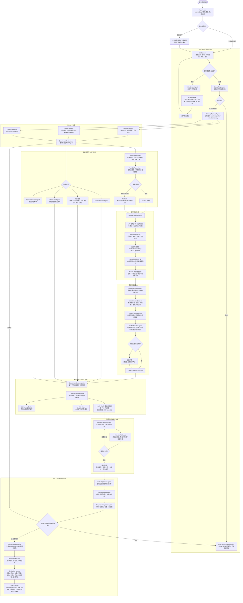

# Agentic RAG Eval 中文版

这是一个面向实习项目展示的 **医疗多 Agent RAG 评测与优化系统**。

项目最初从 Agentic RAG evaluation harness 开始，当前已经扩展为一个医疗问诊方向的多 Agent 系统设计与原型，重点覆盖：

- LangGraph 编排多 Agent 工作流。
- 医疗问诊引导、红旗症状分诊、动态科室专家路由。
- MCP 工具层与医学混合检索。
- LTP 医疗分词、BM25、医学向量、Neo4j 知识图谱、TransH 关系增强。
- Web 脏数据清洗、证据融合、冲突消解。
- Token 预算管理、多级 token 缓存。
- Session/Profile/Episodic 三层 Memory。
- Prompt injection、工具滥用、记忆污染等安全防御。
- 回诊系统、评测体系和网页可视化控制台设计。

> 项目定位：不是替代医生诊断，而是构建一个可观测、可评测、可解释的医疗信息辅助与问诊准备系统。

## 项目总流程图



## 当前已实现内容

代码层面已实现：

- LangGraph evaluation harness。
- Mock / HTTP RAG Client。
- JSONL / CSV / Markdown 评测报告输出。
- `ContextBudgetManager` 轻量 token 打包。
- L1 memory cache + L2 disk cache 的 token 多级缓存。

设计层面已完成：

- 医疗问诊多 Agent 总架构。
- 医疗知识检索与图谱增强设计。
- LTP 医疗分词 + 医学词典增强。
- Neo4j 知识图谱构建。
- TransH 关系增强表达。
- Memory 系统。
- Token 优化。
- Prompt injection 防御。
- 回诊系统。
- 评测体系。
- Web 可视化控制台。

## 快速运行

在项目目录下运行：

```powershell
$env:PYTHONPATH="src"
python -m agentic_rag_eval run --queries data/eval_queries.jsonl --mock data/mock_rag_responses.json --out reports/smoke
```

或者先安装为 editable package：

```powershell
python -m pip install -e .
python -m agentic_rag_eval run --queries data/eval_queries.jsonl --mock data/mock_rag_responses.json --out reports/smoke
```

输出：

- `reports/smoke/evaluation_results.jsonl`
- `reports/smoke/metrics.csv`
- `reports/smoke/report.md`

## 真实落地组件

当前已真实接入：

- 哈工大 LTP 4 `LTP/small` 中文分词、词性、通用 NER，以及医学词典增强和失败降级。
- `BAAI/bge-small-zh-v1.5` 中文 embedding（FastEmbed ONNX，512 维）。
- Qdrant Local 持久化向量检索。
- MySQL 8 知识治理代码路径与 Compose（PyMySQL、InnoDB、utf8mb4）；当前机器无 MySQL 服务，服务端 E2E 待启动后验证。
- MCP stdio server/client。
- PubMed/NCBI 联网检索。
- openFDA 官方药品说明书检索。
- FastAPI `/consult`、`/health`、`/knowledge/reindex`。
- OpenAI/Gemini/DeepSeek/GitHub Models 等可选 LLM API；未配置 key 时安全 fallback。
- CBLUE/CMB/CMExam/PromptCBLUE/MedBench 中文医疗 benchmark registry、数据探测器和 CMeEE-V2 评测 runner。
- IMCS-21 作者官方 GitHub corpus（2,472/833/811 对话）及严格医疗 NER 对照评测；前 1,000 句预览中 Recall 由 7.55% 提升至 88.52%，F1 由 14.01% 提升至 67.55%，同时暴露 Precision 下降问题并新增 LTP 分词边界过滤。
- cMedQA2 作者官方 GitHub 数据（108,000 个问题、203,569 个回答）已下载并校验，后续用于 BGE 医疗答案检索与 reranker benchmark；仅限非商业研究。

启动 API：

```powershell
python -m pip install -e .
python -m uvicorn program.api:app --host 127.0.0.1 --port 8000 --workers 1
```

## 运行医疗多 Agent MVP

## 运行医疗多 Agent 问诊系统

通过标准 CLI 命令行运行：

```powershell
doctor-agent --case data/sample_case.json --knowledge data/mock_medical_knowledge.json --out reports/program-demo/sample_case_result.json
```
或通过 Python 模块调用：
```powershell
python -m doctor_agent.cli --case data/sample_case.json --knowledge data/mock_medical_knowledge.json --out reports/program-demo/sample_case_result.json
```

攻击样例（提示词注入防御与急症熔断）：

```powershell
doctor-agent --case data/attack_case.json --knowledge data/mock_medical_knowledge.json --out reports/program-demo/attack_case_result.json
```

启动 FastAPI 本地医疗问诊服务：

```powershell
python -m uvicorn doctor_agent.api:app --host 127.0.0.1 --port 8000 --workers 1
```

输出包含完整 LangGraph trace、风险分级、专家路由、融合证据、token 预算、回诊计划、memory 写入和评测摘要。

## Token 预算与多级缓存 Demo

```powershell
agentic-rag-eval pack-context `
  --input data/sample_token_context.json `
  --out reports/token-packed/context.json `
  --budget 2000 `
  --cache-dir .cache/token
```

这个命令会：

- 压缩医学知识。
- 过滤低相关证据。
- 保留最近对话和 profile card。
- 控制上下文在 2000 token 左右。
- 使用 L1/L2 缓存复用压缩结果。

## 接入真实 RAG API

HTTP RAG Client 期望接口：

```json
{"question": "..."}
```

返回：

```json
{"answer": "...", "contexts": ["..."]}
```

运行评测：

```powershell
python -m agentic_rag_eval run --queries data/eval_queries.jsonl --endpoint http://localhost:8000/query --out reports/local-api
```

## 文档导航

请从 [docs/README.md](docs/README.md) 开始阅读完整文档地图，包含核心学习手册 [docs/PROJECT_LEARNING_MANUAL.md](docs/PROJECT_LEARNING_MANUAL.md) 及 [docs/modules/](docs/modules/) 细分模块指南。

核心文档：

- [docs/architecture.md](docs/architecture.md) — 项目架构与数据契约。
- [docs/medical-multi-agent-design.md](docs/medical-multi-agent-design.md) — 医疗问诊多 Agent 主设计。
- [docs/medical-knowledge-retrieval-design.md](docs/medical-knowledge-retrieval-design.md) — 医学知识检索、LTP、RAG 索引、Neo4j、TransH。
- [docs/chinese-medical-benchmarks.md](docs/chinese-medical-benchmarks.md) — LTP 真实接入、中文医疗 benchmark、许可和评测方式。
- [docs/memory-system-design.md](docs/memory-system-design.md) — session/profile/episodic 三层 Memory。
- [docs/token-optimization-design.md](docs/token-optimization-design.md) — token 压缩、预算管理和多级缓存。
- [docs/security-defense-design.md](docs/security-defense-design.md) — prompt injection 和 Agent/工具/记忆防御。
- [docs/evaluation-methodology.md](docs/evaluation-methodology.md) — 统一评估方法。
- [docs/follow-up-system-design.md](docs/follow-up-system-design.md) — 回诊系统。
- [docs/web-visualization-design.md](docs/web-visualization-design.md) — Web 可视化控制台。
- [docs/langchain-langgraph-implementation.md](docs/langchain-langgraph-implementation.md) — 当前 LangChain + LangGraph 实现拆解。
- [docs/interview-pack.md](docs/interview-pack.md) — 简历和面试材料草稿。
- [interview.md](interview.md) — 面试官视角的项目专项问题与参考答案。

## 面试讲法

一句话版本：

> 这是一个基于 LangGraph 的医疗多 Agent RAG 系统，包含引导式问诊、安全分诊、动态科室专家路由、MCP 工具调用、医学混合检索、Neo4j+TransH 知识图谱、证据融合与冲突消解、token 预算控制、三层 memory、prompt injection 防御、回诊系统和统一评测体系。

项目亮点：

- 不只是聊天框，而是可观测 Agent Runtime。
- 不只是普通 RAG，而是 BM25 + 医学向量 + Neo4j 图谱 + TransH 的混合医学知识底座。
- 不直接回答模糊问题，而是 GuidedIntakeAgent 先追问。
- 不信任网页结果，先做脏数据清洗和检索内容注入防御。
- 不把全部上下文塞给模型，而是 ContextBudgetManager 控制在约 2000 token。
- 不保存全量聊天，而是 session/profile/episodic 三层 memory。
- 不只评答案质量，还评医疗安全、检索证据、Agent 流程、工具稳定性、记忆使用、安全攻击和回诊闭环。
